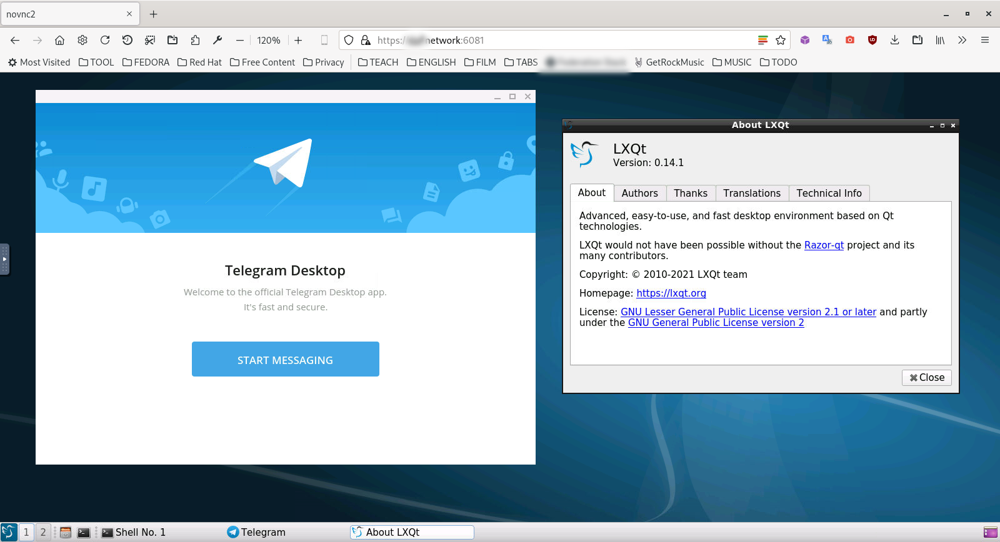

## TLXQT

Run telegram and LXQT desktop environment on the web interface via using docker.



### First generate self signed SSL certificate,

```bash
$ ./ssl.sh
```
### Then build and deploy the docker-compose stack.

```
$ docker-compose up -d --build
```

That's all. Check it: https://0.0.0.0:6081

Notice: The `./disk` folder is mounted to the `/home/telegram/Documents` 

### Start Telegram

Type `Telegram` or `/usr/bin/Telegram` on command line.

### Default Values:

Please edit these in `docker-compose.yml` file.

```bash
USER=telegram
PASSWORD=telegram
HTTP_PASSWORD=telegram  
```
