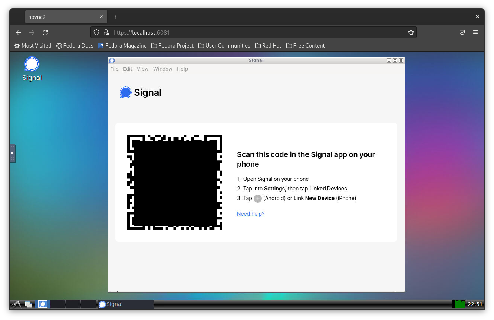

## Signal with Docker

Run Signal and LXDE desktop environment on the web interface via using docker.



### Clone

```bash
$ git clone --single-branch --branch signal https://github.com/rojenzaman/tlxde.git slxde
```


### First generate self signed SSL certificate,

```bash
$ ./ssl.sh
```
### Then build and deploy the docker-compose stack.

```
$ docker-compose up -d --build
```

That's all. Check it: https://0.0.0.0:6081

Notice: The `./documents` folder is mounted to the `/home/signal/Documents` 

### Start Signal

#### In Desktop
Find Signal icon on the desktop and click it.

#### In Terminal
Type `signal-desktop` or `/usr/bin/signal-desktop` on command line.

### Default Values:

Please edit these in `docker-compose.yml` file.

```bash
USER=signal
PASSWORD=signal
HTTP_PASSWORD=signal  
```
